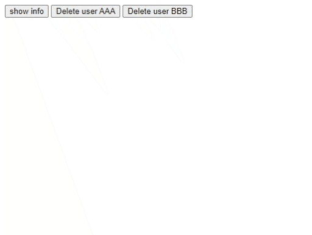
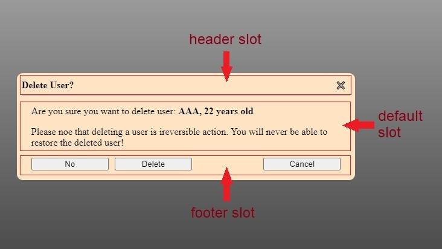

# modal-box component


This is a modal dialog box component. It is customizable and could serve multiple purposes. It is a standard custom web component written in pure vanilla JS, so it could be used in any framework.

> With the package you will find a complete functional example (**example.html, example.css, example.js**)

## Usage:
Use it like any standard tag:
- In html: `<modal-box></modal-box>`
- In JS: `document.createElement("modal-box")`

The following code is extracted from the example accompanying the component.
```html
<modal-box class="confirm">
   <!-- this will go into the header slot -->
   <span slot="header">Delete User?</span>
  
   <!-- these will go into the default slot: the content -->
   <p>Are you sure you want to delete user: <span id="user-info"></span></p>
   <p>Please noe that deleting a user is ireversible action. You will never be able to restore the deleted user!</p>
  
   <!-- this will go into the footer slot -->
   <div slot="footer">
      <button data-action="no">No</button>
      <button data-action="delete">Delete</button>
      <button data-action="cancel">Cancel</button>
   </div>
</modal-box>
```

Notice how you could customize the content of the modal box by adding child html tags inside the component. Also notice how each child tag is assigned to one of the 3 different slots that are making up the component.

The following figure shows the result of the previous code. It also demonstrates the slots that make up the component: **header** slot, article content (**default** slot), and **footer** slot.




## Methods:
- `showModal(openingData)`: call this method to show `modal-box` (usually in response to a user action or a system event). `openingData` is optional and could be of any type (simple or object), it could be retrieved when the `modal-box` is closed (in `modal-box-closed` event). `openingData` enables attaching dynamic data to the same `modal-box` so that versatile functionality could be achieved (see the accompanying example).

- `close(closingData)`: call this method to hide the modal-box (usually in response to a user action). `closingData` is optional and could be of any type (simple or object), it could be retrieved in `modal-box-closed` event. `closingData` could be used to make code general and compact (see the accompanying example).

> Please note that `Esc` key and `✖️` close button (in the upper right corner) both close the `modal-box` without any intervention from the developer.

## Events:
- `modal-box-opened`: this event enables developers to take actions when the component is opened. `event.detail` will have the property `openingData`, which is the same passed parameter when `showModal(openingData)` is called.

- `modal-box-closed`: this event enables developers to take actions when the component is closed. `event.detail` will have the following properties:
   - `openingData`: the same passed parameter when `showModal(openingData)` is called.
   - `closingData`: the same passed parameter when `close(closingData)` is called.
   - `closingSource`: of type `DialogClosingSourcesEnum` (which is defined and exported inside the component's module). It indicates how the modal box was closed.

> See the accompanying example for possible usage of these events.

## Styling:
1. Define in an element's selector block one or more of the following custom properties:
   - `--bg-color`: the modal box's background-color. Default is `aliceblue`.
   - `--inline-size`: the inline-size of the component when it is shown. Default is 75%.
   - `--max-inline-size`: since the default inline-size is a percentage, this custom property is used to prevent having too wide modal box when the screen is too wide. Default is 40rem.

2. Or you can reach the 3 constituent parts of the component (which correspond the 3 slots shown in the previous figure):
   - `::part(header)`: it is actually a `header` tag. Corresponds the header slot.
   - `::part(article)`: it is actually a `article` tag. Corresponds the default slot.
   - `::part(footer)`: it is actually a `footer` tag. Corresponds the footer slot.

> `block-size` is determined by the content of the component, but it has a maximum of 85vh.
